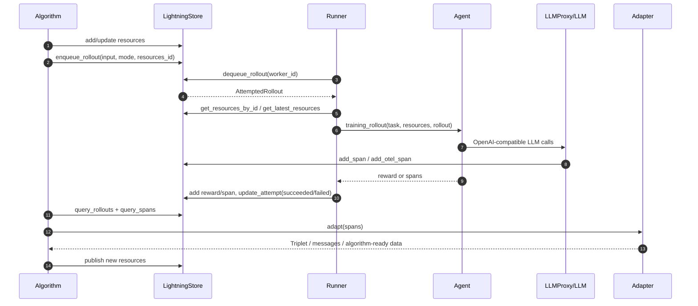

# Agent Lightning 中文说明文档

生成日期：2026-06-11

资料来源：

- 论文：`agent_lightning_paper.pdf`，标题为 *Agent Lightning: Train ANY AI Agents with Reinforcement Learning*。
- 仓库代码：`agentlightning/`、`docs/`、`examples/`、`dashboard/`、`contrib/`。
- 项目入口文档：`README.md`、`docs/index.md`、`docs/deep-dive/*.md`、`pyproject.toml`。

本文面向第一次阅读该项目的开发者，结合论文方法和当前仓库实现，说明 Agent Lightning 要解决的问题、核心设计、代码结构、运行流程和二次开发入口。

## 1. 项目定位

Agent Lightning 是一个面向 AI Agent 的训练与优化框架。它的目标是让已有 Agent 能够在尽量少改代码的情况下接入强化学习、自动提示词优化、监督微调等算法。

论文中的核心主张可以概括为：

1. Agent 运行逻辑和训练算法完全解耦。
2. 任意 Agent 执行过程都可以抽象成统一的轨迹数据。
3. 通过 transition 级别的数据接口，将复杂多轮、多工具、多 Agent 工作流转换为可训练样本。
4. 用 Training-Agent Disaggregation 架构，让训练端只关心模型、资源和优化，让 Agent 端继续按原来的应用逻辑运行。

当前仓库实现已经从早期 HTTP Server/Client 形态，演进到以 `LightningStore` 为核心控制面的实现。旧的 `AgentLightningServer`、`AgentLightningClient` 仍保留兼容，但代码注释明确建议新工作流优先使用 store-based API。

## 2. 论文要点

### 2.1 背景问题

现代 AI Agent 通常不只是一次 LLM 调用，而是由 LLM、工具、外部 API、环境和框架编排组成。例如：

- LangChain 中的 Text-to-SQL Agent 会生成 SQL、执行 SQL、检查结果、必要时重写 SQL。
- RAG Agent 会生成检索 query、调用检索器、根据返回文档生成答案。
- 数学或软件工程 Agent 会在多轮过程中调用计算器、代码执行器或外部服务。

传统 LLM RL 框架多面向单轮 prompt-response 任务。要训练 Agent，常见做法是把多轮内容拼接成一个长序列，再通过 mask 指定哪些 token 参与优化。论文认为这种方式存在几个问题：

- 训练代码需要理解 Agent 的执行逻辑，导致训练和应用强耦合。
- 多轮拼接会使上下文不断变长，增加内存和计算成本。
- mask 逻辑复杂，难调试，也可能破坏位置编码连续性假设。
- 很难自然支持多 Agent、动态工作流、工具调用和选择性优化。

### 2.2 统一数据接口

论文把 Agent 执行过程视为由组件调用组成的序列。组件可以是 LLM，也可以是工具、环境或 API。

一次组件调用可以表示为：

```text
call = (meta, input, output)
```

其中：

- `meta`：组件名称、类型、版本、端点、温度等运行参数。
- `input`：组件可见的输入，例如 LLM prompt、工具参数。
- `output`：组件产生的输出，例如 LLM response、工具返回值。

一次带奖励的执行可以表示为：

```text
executionR = [(call_1, reward_1), ..., (call_N, reward_N)]
```

很多真实任务只有终局奖励，例如答案是否正确。Agent Lightning 的接口也允许中间奖励，例如工具调用成功、格式正确、局部子任务完成。

### 2.3 将 Agent 执行建模为 MDP/POMDP

论文把要优化的 LLM 看成 policy model：

- `state`：Agent 当前执行快照，包括关键变量、上下文、工具返回值、程序状态等。
- `observation`：当前 LLM 调用能看到的输入，也就是 LLM prompt 或 chat messages。
- `action`：一次 LLM 调用生成的完整输出序列。
- `reward`：该动作或整个 episode 对应的奖励。

关键点是：Agent Lightning 不要求训练端解析完整执行 DAG，也不要求知道 prompt 是如何一步步构造出来的。它只需要拿到每次 LLM 调用的输入、输出和奖励。

### 2.4 LightningRL

LightningRL 是论文提出的分层 RL 思路。它不是把所有轮次拼成一个长序列，而是把 Agent 轨迹拆成多个 transition：

```text
transition = (LLM input, LLM output, reward)
```

episode 级别的 return 会先通过 credit assignment 模块分配到每个 LLM 调用，再由已有单轮 LLM RL 算法继续处理 token 级优化。

论文当前实现中，credit assignment 的基础策略比较简单：将最终 return 分配给轨迹中的相关动作。论文也指出未来可以接入更复杂的价值函数、启发式分配或学习式 credit assignment。

这种 transition 方案的优点：

- 能复用已有 PPO、GRPO、REINFORCE++ 等单轮 LLM RL 思路。
- 每个 LLM 调用作为独立样本，避免轨迹拼接过长。
- 更容易选择性优化某些 Agent 或某类 LLM 调用。
- 训练接口不绑定 LangChain、OpenAI Agents SDK、AutoGen 等具体框架。

### 2.5 Training-Agent Disaggregation

论文的系统架构将训练和 Agent 执行拆开：

- 训练端负责模型更新、任务分发、资源更新、数据管理。
- Agent 端负责运行已有应用逻辑、调用模型和工具、采集 trace 与 reward。

论文中称为 Lightning Server 和 Lightning Client。当前代码实现中，更核心的抽象是：

- `Trainer`：把算法、runner、store、tracer、adapter、LLM proxy 组装起来。
- `LightningStore`：保存 rollout、attempt、span、resource、worker，是任务队列和状态中心。
- `Runner`：从 store 取任务，运行 Agent，写回 trace 和 reward。
- `Algorithm`：读任务结果和 trace，更新资源或模型。
- `LLMProxy`：在 Agent 和真实模型服务之间转发请求，并采集 token id、logprobs 和 OpenTelemetry spans。

## 3. 实验结果概览

论文在三个任务上验证了 Agent Lightning：


| 任务                 | Agent 框架        | 数据集  | 工具                | Agent 数量 | 被优化 Agent |
| -------------------- | ----------------- | ------- | ------------------- | ---------- | ------------ |
| Text-to-SQL          | LangChain         | Spider  | SQL executor        | 3          | 2            |
| Open-domain QA / RAG | OpenAI Agents SDK | MuSiQue | Wikipedia retriever | 1          | 1            |
| Math QA              | AutoGen           | Calc-X  | Calculator          | 1          | 1            |

实验统一使用 Llama-3.2-3B-Instruct 作为基础模型。论文展示的训练曲线和测试曲线都表明，在这些多步、工具增强、开放式或多 Agent 场景中，Agent Lightning 能带来持续且相对稳定的性能提升。

## 4. 当前仓库结构

仓库根目录的重要内容如下：

```text
agentlightning/       Python 主包，包含训练、运行、存储、追踪、算法、资源和 CLI。
docs/                 MkDocs 文档，包括教程、how-to、deep-dive、API reference。
examples/             官方示例，包括 minimal、APO、RAG、Spider、Calc-X、Unsloth、Claude Code 等。
contrib/              扩展示例和实验配方，例如 WebShop、Search-R1、AgentOS、环境训练。
dashboard/            前端可视化界面，React/Vite 结构。
tests/                单元测试和集成测试，按模块镜像主包结构。
docker/               MongoDB、Prometheus、Grafana、store 等服务编排。
scripts/              环境、CI、OpenAPI、发布和辅助脚本。
```

主包 `agentlightning/` 的模块职责如下：


| 模块           | 作用                                                                         |
| -------------- | ---------------------------------------------------------------------------- |
| `types/`       | Pydantic 数据模型，如`Rollout`、`Attempt`、`Span`、`Resource`、`Triplet`。   |
| `store/`       | `LightningStore` 抽象及 InMemory、Mongo、client/server、threaded 等实现。    |
| `trainer/`     | `Trainer` 高层编排入口，负责组装算法、runner、store、tracer、adapter。       |
| `runner/`      | `Runner` 抽象与 `LitAgentRunner`，负责取任务、执行 Agent、写回 spans。       |
| `litagent/`    | Agent 基类和装饰器，将普通函数包装成可训练 Agent。                           |
| `algorithm/`   | 算法接口与内置算法，包含`Baseline`、`APO`、`VERL`。                          |
| `adapter/`     | 将 trace spans 转换为训练数据，如`TracerTraceToTriplet`、`TraceToMessages`。 |
| `tracer/`      | OpenTelemetry、AgentOps、Weave 等追踪器。                                    |
| `emitter/`     | 显式发出 reward、annotation、message、operation 等 span。                    |
| `llm_proxy.py` | 基于 LiteLLM 的 LLM 代理，负责请求转发、token id、OTel 导出。                |
| `execution/`   | 执行策略，当前`Trainer` 默认使用 client/server execution strategy。          |
| `cli/`         | `agl` 命令，包括 `store`、`vllm`、`prometheus` 等子命令。                    |

## 5. 核心概念与代码映射

### 5.1 Rollout、Attempt、Span

代码位置：`agentlightning/types/core.py`、`agentlightning/types/tracer.py`

- `Rollout`：一次任务执行的外部视图。包含 `rollout_id`、`input`、`mode`、`resources_id`、`status`、`config`。
- `Attempt`：一次 rollout 的具体执行尝试。失败、超时或无响应时，一个 rollout 可以有多次 attempt。
- `Span`：Agent 执行过程中产生的结构化事件，兼容 OpenTelemetry。LLM 调用、工具调用、reward 都可以是 span。
- `RolloutConfig`：控制超时、无响应阈值、最大重试次数和重试条件。

状态流大致如下：

```text
Rollout: queuing -> preparing -> running -> succeeded/failed/cancelled
Attempt: preparing -> running -> succeeded/failed/timeout/unresponsive
```

如果 attempt 失败且满足 `retry_condition`，rollout 会进入 `requeuing`，然后创建新的 attempt。

### 5.2 Resource

代码位置：`agentlightning/types/resources.py`

资源是算法交给 runner 的可调对象。当前主要类型：

- `LLM`：模型 API 端点、模型名、API key、采样参数。
- `ProxyLLM`：通过 `LLMProxy` 路由的 LLM 资源，可以在 endpoint 中加入 rollout/attempt 信息。
- `PromptTemplate`：提示词模板，当前 `format()` helper 支持 `f-string`。
- `NamedResources`：资源字典，例如 `{"main_llm": LLM(...), "prompt": PromptTemplate(...)}`。

论文里提到的“被优化组件”在代码里通常体现为可版本化的 resource。强化学习更新的是模型相关资源，APO 更新的是提示词模板资源。

### 5.3 LitAgent 与 rollout 装饰器

代码位置：`agentlightning/litagent/`

`LitAgent` 是 Agent 的运行接口。开发者可以继承它，也可以用装饰器包装普通函数：

```python
import agentlightning as agl


@agl.rollout
def my_agent(task, llm: agl.LLM) -> float:
    # 使用 llm.endpoint / llm.model 调用模型
    # 返回 float 时会被 runner 作为 final reward 记录
    return 1.0
```

装饰器会根据函数签名注入资源：

- `(task, llm)` 或 `(task, llm, rollout)`：注入第一个 LLM 资源。
- `(task, prompt_template)` 或 `(task, prompt_template, rollout)`：注入第一个 prompt template 资源。

函数返回值可以是：

- `None`：依赖 tracer 自动采集。
- `float`：作为最终 reward。
- `List[ReadableSpan]`：OpenTelemetry spans。
- `List[Span]` 或 `List[SpanCoreFields]`：Agent Lightning 自有 span 类型。

### 5.4 LightningStore

代码位置：`agentlightning/store/`

`LightningStore` 是当前代码实现中最重要的控制面。它既是任务队列，也是 trace 和资源存储。

主要职责：

- `enqueue_rollout()`：算法提交任务。
- `dequeue_rollout()`：runner 领取任务并创建 attempt。
- `add_span()` / `add_otel_span()`：写入 trace，同时作为心跳。
- `add_resources()` / `update_resources()`：发布资源快照。
- `query_rollouts()` / `query_spans()`：供算法读取执行结果。
- `update_attempt()`：推进 attempt 和 rollout 状态。

内置实现包括：

- `InMemoryLightningStore`：默认实现，适合本地开发和测试。
- `MongoLightningStore`：MongoDB 后端。
- `LightningStoreServer` / `LightningStoreClient`：通过 HTTP/OTLP 让多进程或多机访问 store。
- `LightningStoreThreaded`：为线程场景提供封装。

### 5.5 Runner

代码位置：`agentlightning/runner/`

`LitAgentRunner` 执行单个或多个 Agent worker。核心流程：

1. 从 `LightningStore` 领取 `AttemptedRollout`。
2. 获取 `resources_id` 对应的资源快照。
3. 进入 tracer 的 `trace_context`。
4. 调用 Agent 的 `training_rollout` 或 `validation_rollout`。
5. 将返回的 reward 或 spans 标准化并写入 store。
6. 将 attempt 标记为 `succeeded` 或 `failed`。
7. 后台周期性写入 worker heartbeat。

Runner 还支持 hooks：

- `on_rollout_start`
- `on_trace_start`
- `on_trace_end`
- `on_rollout_end`

这些 hooks 适合做自定义日志、资源准备、清理、额外指标上报。

### 5.6 Adapter

代码位置：`agentlightning/adapter/`

Adapter 对应论文中的“从执行轨迹提取训练 transition”。默认重要实现是 `TracerTraceToTriplet`。

`TracerTraceToTriplet` 的逻辑包括：

- 将 flat spans 重建成 `TraceTree`。
- 修复混合 tracer 导致的 parent-child 关系缺失。
- 根据 `llm_call_match` 找 LLM 调用，默认匹配 `openai.chat.completion`。
- 根据 `agent_match` 选择性过滤某些 Agent。
- 提取 prompt token ids、response token ids、原始 prompt/response 内容、response id。
- 根据 reward span 匹配奖励，输出 `Triplet(prompt, response, reward, metadata)`。

这正是论文里 transition 级训练数据的代码落点。

### 5.7 Algorithm

代码位置：`agentlightning/algorithm/`

`Algorithm` 是训练或优化策略的基类。`Trainer` 会向算法注入：

- `store`
- `adapter`
- `initial_resources`
- 可选 `llm_proxy`
- trainer 弱引用

内置算法：

- `Baseline`：快速开发用基线算法，主要用于提交数据集、等待 rollout 完成、打印 spans 和 adapter 输出。
- `APO`：Automatic Prompt Optimization，基于 textual gradients 和 beam search 优化 prompt。
- `VERL`：接入 verl PPO 训练，支持 RL 训练场景。

### 5.8 LLMProxy

代码位置：`agentlightning/llm_proxy.py`

`LLMProxy` 基于 LiteLLM，位于 Agent 和真实模型服务之间。主要作用：

- 提供统一 OpenAI-compatible endpoint。
- 将请求路由到 OpenAI、Anthropic、本地 vLLM/SGLang 等后端。
- 在 URL 中注入 `/rollout/{rollout_id}/attempt/{attempt_id}`。
- 为每次请求分配单调递增 `sequence_id`，避免分布式时钟偏差影响排序。
- 自动添加 `return_token_ids=True` 和 `logprobs=1` 等请求参数。
- 通过 OpenTelemetry exporter 将 LLM 调用 spans 写入 `LightningStore`。

对于 RL 训练，token id 很重要。仓库文档指出，仅保存文本再 retokenize 可能引入 chat template、tool call 序列化和 tokenizer 差异，导致训练数据和真实生成不一致。因此，Agent Lightning 尽量在模型服务返回时直接记录 prompt/response token ids。

## 6. 端到端运行流程

当前代码主线可以用下图表示：



从论文角度看：

- Agent 执行过程由 Runner 触发。
- LLM 调用、工具调用、reward 被记录成 spans。
- Adapter 将 spans 转换成 transition/triplet。
- Algorithm 根据 triplet 进行 RL、prompt optimization 或其他优化。
- 更新后的模型端点或提示词模板作为 resources 发布给下一轮 rollout。

## 7. 快速上手路径

### 7.1 安装开发环境

仓库推荐使用 `uv`：

```bash
uv sync --group dev
```

如果遇到 `~/.cache` 权限问题，可以按仓库说明覆盖缓存位置：

```bash
UV_CACHE="$(pwd)/.cache_uv" XDG_CACHE_HOME="$(pwd)/.cache_xdg" uv run --no-sync <command>
```

常用校验命令：

```bash
uv run --no-sync pytest -v
uv run --no-sync pyright
uv run --no-sync pre-commit run --all-files --show-diff-on-failure
uv run --no-sync mkdocs build --strict
```

作为库使用时，也可以直接安装：

```bash
pip install agentlightning
```

### 7.2 最小训练骨架

下面是一个简化骨架，用于理解组件关系。实际项目中需要替换为真实模型调用和 reward 函数。

```python
import agentlightning as agl


@agl.rollout
def my_agent(task, prompt_template: agl.PromptTemplate) -> float:
    prompt = prompt_template.format(task=task["question"])
    # 在这里调用 LLM、工具或已有 Agent 框架
    # 根据结果计算 reward
    return 1.0 if prompt else 0.0


trainer = agl.Trainer(
    algorithm=agl.Baseline(),
    n_runners=1,
    initial_resources={
        "prompt": agl.PromptTemplate(
            template="请回答问题：{task}",
            engine="f-string",
        ),
    },
)

trainer.dev(
    agent=my_agent,
    train_dataset=[{"question": "Agent Lightning 是什么？"}],
)
```

### 7.3 查看示例

建议按下面顺序阅读：

1. `examples/minimal/`：单独展示 store、trace、LLM proxy、vLLM lifecycle。
2. `examples/apo/`：展示自动提示词优化。
3. `examples/rag/`：RAG Agent 训练示例。
4. `examples/spider/`：Text-to-SQL 示例，对应论文实验之一。
5. `examples/calc_x/`：数学工具调用示例，对应论文实验之一。
6. `examples/unsloth/`：SFT 工作流。
7. `contrib/recipes/`：更实验性或更大规模的配方。

## 8. 二次开发指南

### 8.1 接入已有 Agent

推荐路径：

1. 保持原 Agent 主逻辑不变。
2. 用 `@agl.rollout` 包装一个入口函数，或继承 `LitAgent`。
3. 在函数参数中声明需要的资源，例如 `llm` 或 `prompt_template`。
4. 在 Agent 运行中返回最终 reward，或调用 `emit_reward()` 发出中间奖励。
5. 用 `Trainer` 配置算法、资源、runner 数量和数据集。

如果已有 Agent 已经使用 OpenAI-compatible API，可以优先通过 `LLMProxy` 接入，从代理端采集 LLM spans 和 token ids。

### 8.2 写一个新算法

继承 `agentlightning.algorithm.Algorithm` 并实现 `run()`：

```python
class MyAlgorithm(agl.Algorithm):
    async def run(self, train_dataset=None, val_dataset=None):
        store = self.get_store()
        adapter = self.get_adapter()

        resources = self.get_initial_resources()
        if resources is not None:
            update = await store.add_resources(resources)
            resources_id = update.resources_id
        else:
            resources_id = None

        rollout = await store.enqueue_rollout(
            input=train_dataset[0],
            mode="train",
            resources_id=resources_id,
        )
        completed = await store.wait_for_rollout(rollout.rollout_id)
        spans = await store.query_spans(rollout_id=rollout.rollout_id)
        training_data = adapter.adapt(spans)
        # 根据 training_data 更新模型或 prompt，然后发布新 resources
```

算法通常只需要理解 store 和 adapter，不需要知道 Agent 内部如何调用 LangChain、AutoGen 或工具。

### 8.3 自定义 trace 到训练数据的转换

当默认 `TracerTraceToTriplet` 不够用时，可以实现自己的 `TraceAdapter`。常见场景：

- 只训练某个 Agent 名称下的 LLM 调用。
- 只选择某类 span，例如特定工具前后的 LLM 调用。
- 将 spans 转换成 chat messages，用于 APO、SFT 或自定义优化器。
- 使用多维 reward 或自定义 credit assignment。

默认 adapter 已支持 `agent_match`、`llm_call_match`、`reward_match` 等配置，可先尝试配置而不是直接改代码。

### 8.4 扩展 Store

如果需要持久化、跨机器或高吞吐场景，可以实现新的 `LightningStore` 后端。仓库的分层是：

- collections 层：`Collection`、`Queue`、`KeyValue` 等存储原语。
- store 层：状态机、watchdog、重试策略、资源版本、span 顺序。
- wrapper 层：HTTP client/server、threaded 等跨进程或并发封装。

对于生产场景，需要重点关注：

- rollout 和 attempt 状态一致性。
- span sequence id 的单调性。
- 多 runner 并发 dequeue 的原子性。
- 超时、无响应和重试策略。
- trace 数据量导致的内存或存储压力。

## 9. 与论文概念的代码对照表


| 论文概念                      | 当前代码落点                                                      |
| ----------------------------- | ----------------------------------------------------------------- |
| Agent execution               | `LitAgent.rollout()` / `FunctionalLitAgent` / 示例中的 agent 函数 |
| Component invocation          | OpenTelemetry`Span`，尤其是 LLM call span、tool span、reward span |
| State / observation           | LLM prompt、chat messages、span attributes、resource 上下文       |
| Action                        | 单次 LLM response，通常含 response token ids                      |
| Reward                        | `emit_reward()`、rollout 返回 `float`、reward spans               |
| Transition                    | `Triplet(prompt, response, reward, metadata)`                     |
| Unified data interface        | `TraceAdapter`，尤其是 `TracerTraceToTriplet`                     |
| Credit assignment             | Adapter 和算法侧 reward 分配逻辑，VERL/RL 侧继续处理 token 级训练 |
| Training-Agent Disaggregation | `Trainer` + `ExecutionStrategy` + `LightningStore` + `Runner`     |
| Server/Client                 | 新主线为`LightningStore`，旧兼容为 `AgentLightningServer/Client`  |
| Observability                 | `tracer/`、`emitter/`、`LLMProxy`、OpenTelemetry spans            |
| Selective optimization        | `agent_match`、resource 更新、算法选择的 transition 子集          |

## 10. 重要实现细节

### 10.1 当前默认运行栈

`Trainer` 默认会构造：

- `AgentOpsTracer` 作为 tracer。
- `TracerTraceToTriplet` 作为 adapter。
- `InMemoryLightningStore` 作为 store。
- `LitAgentRunner` 作为 runner。
- `ClientServerExecutionStrategy` 作为 execution strategy。

如果传入 `port`，会把端口交给 client/server execution strategy。

### 10.2 旧 API 兼容

`agentlightning/client.py` 和 `agentlightning/server.py` 中的 `AgentLightningClient`、`AgentLightningServer` 都标记为 deprecated。它们服务于旧 HTTP 协议：

- `/task`
- `/resources`
- `/resources/latest`
- `/rollout`

新代码应优先围绕 `LightningStore` 编写。

### 10.3 Reward 采集

有三种常见方式：

1. Agent rollout 返回 `float`，runner 自动生成 reward span。
2. 在 Agent 内部调用 `agentlightning.emit_reward()`，可记录中间奖励。
3. 通过 AgentOps 或其他 tracer 记录 reward 结构，再由 adapter 提取。

对于多维 reward，`emit_reward()` 支持传入字典，但必须指定 `primary_key`。

### 10.4 Token IDs

`TracerTraceToTriplet` 会优先从 span attributes 中提取：

- `prompt_token_ids`
- `response_token_ids`
- `agentlightning.operation.output.choices.0.token_ids`
- `agentlightning.operation.output.choices.0.provider_specific_fields.token_ids`

`LLMProxy` 会尽量让 vLLM 等后端返回 token ids。对于不支持 token ids 的服务，仍保留 raw messages 作为 fallback。

## 11. Dashboard 与可观测性

`dashboard/` 是前端可视化工程，使用 React/Vite。它围绕 store 中的实体展示：

- rollouts
- traces
- resources
- workers
- settings

配套的 Docker 目录包含 Prometheus、Grafana、MongoDB 等服务编排。对于长时间训练或多 runner 任务，dashboard 和 metrics 能帮助观察：

- 哪些 rollout 失败或超时。
- 哪个 worker 正在处理哪个 attempt。
- span 和 reward 的时序。
- resources 是否完成版本更新。

## 12. 适用场景与限制

适用场景：

- 已有 Agent 需要在真实任务数据上持续优化。
- Agent 使用工具、环境、数据库、检索器、代码执行器等复杂外部组件。
- 多 Agent 系统中只想优化部分角色。
- 想复用现有 Agent 框架，而不是把 Agent 重写进 RL 框架。
- 需要收集细粒度 trace、reward 和 token ids 用于 RL/SFT/APO。

限制和注意事项：

- RL 训练仍依赖底层模型服务、GPU 资源和算法配置，Agent Lightning 主要解决数据和系统解耦。
- 对于不返回 token ids 的模型服务，训练端可能需要 retokenization，存在不一致风险。
- 中间奖励和 credit assignment 的质量会直接影响复杂长程任务训练效果。
- InMemory store 适合开发，不适合持久化或大规模多机训练。
- 旧 HTTP Client/Server API 仍可用，但新开发应使用 `LightningStore`。

## 13. 开发与贡献注意事项

仓库本身的开发规范要点：

- Python 版本要求：`requires-python >= 3.10`。
- 使用 Black + isort，行宽 120。
- 类型检查由 `pyright` 执行。
- 新模块或公开方法使用 Google-style docstrings。
- 测试目录应镜像运行时代码目录。
- 示例需要 README，并包含 smoke-test 指令和 "Included Files" 章节。
- 改依赖时需要同步提交 `uv.lock`。

常用命令：

```bash
uv sync --group dev
uv run --no-sync pytest -v
uv run --no-sync pyright
uv run --no-sync pre-commit run --all-files --show-diff-on-failure
uv run --no-sync mkdocs build --strict
```

## 14. 阅读路线建议

如果目标是理解论文和系统：

1. 阅读 `agent_lightning_paper.pdf` 的第 3 节，重点是 Unified Data Interface、MDP 和 LightningRL。
2. 阅读 `docs/deep-dive/birds-eye-view.md`，理解 Algorithm、Runner、Store 循环。
3. 阅读 `agentlightning/types/core.py` 和 `agentlightning/store/base.py`，理解数据模型和 store 合约。
4. 阅读 `agentlightning/runner/agent.py`，理解 rollout 如何执行和写回。
5. 阅读 `agentlightning/adapter/triplet.py`，理解 spans 如何变成训练样本。
6. 阅读 `agentlightning/algorithm/fast.py`，看最简单的算法如何使用 store。
7. 再进入 `agentlightning/algorithm/verl/` 或 `agentlightning/algorithm/apo/` 看具体训练算法。

如果目标是快速改造自己的 Agent：

1. 看 `docs/how-to/train-first-agent.md`。
2. 看 `examples/apo/` 或 `examples/minimal/`。
3. 先用 `Baseline` 或 `Trainer.dev()` 跑通 trace 和 reward。
4. 再换成 APO、VERL 或自定义算法。

## 15. 总结

Agent Lightning 的本质不是一个新的 Agent 框架，而是一套把“Agent 执行数据”变成“训练数据”的桥接系统。论文贡献在于用 MDP/transition 视角统一了任意 Agent 的执行轨迹，并用 LightningRL 避免了多轮拼接和复杂 mask。仓库实现则把这个思想落在 `LightningStore`、`Runner`、`Tracer`、`Adapter`、`Algorithm`、`LLMProxy` 这些可替换组件上。

理解这个项目时，可以抓住一条主线：

```text
Agent 运行 -> 产生 spans/rewards -> Store 汇总 -> Adapter 转换 -> Algorithm 学习 -> Resource 更新 -> Agent 下一轮运行
```

只要这条链路跑通，就可以在不重写 Agent 主体逻辑的前提下，逐步接入提示词优化、监督微调或强化学习训练。
